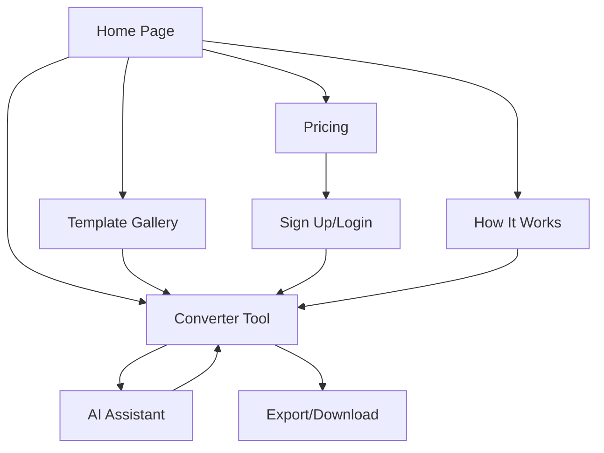

# SVGCodeToPNG Product Requirements Document

## 1. Product Overview

SVGCodeToPNG is a powerful online tool that converts SVG code directly to high-quality PNG images with AI-powered editing capabilities. Designed for developers, designers, and content creators who need quick and reliable SVG to PNG conversion with advanced features like template library, code editing, and AI-assisted optimization.

The product targets users searching for SVG conversion solutions on Google, providing a comprehensive platform that goes beyond basic conversion to include AI-powered code generation, optimization, and animation planning capabilities.

## 2. Core Features

### 2.1 User Roles

| Role            | Registration Method      | Core Permissions                                              |
| --------------- | ------------------------ | ------------------------------------------------------------- |
| Guest User      | No registration required | Basic SVG to PNG conversion, template browsing                |
| Registered User | Email registration       | Save projects, access premium templates, basic AI features    |
| Premium User    | Subscription upgrade     | Full AI capabilities, unlimited conversions, priority support |

### 2.2 Feature Module

Our SVG to PNG converter consists of the following main pages:

1. **Home Page**: Hero section with converter tool, feature highlights, template gallery preview
2. **Converter Tool Page**: Main conversion interface, code editor, real-time preview, download options
3. **Template Gallery**: 1000+ SVG templates, category filters, search functionality
4. **AI Assistant Page**: AI-powered code generation, optimization suggestions, animation planning
5. **How It Works**: Step-by-step guide, tutorial videos, best practices
6. **Pricing**: Free vs premium features, subscription plans, feature comparison
7. **About/Contact**: Company information, support resources, feedback form

### 2.3 Page Details

| Page Name        | Module Name             | Feature Description                                                         |
| ---------------- | ----------------------- | --------------------------------------------------------------------------- |
| Home Page        | Hero Section            | Display main value proposition with embedded quick converter tool           |
| Home Page        | Feature Highlights      | Showcase key features: AI assistance, template library, high-quality output |
| Home Page        | Template Preview        | Display popular SVG templates with hover effects and quick preview          |
| Home Page        | How It Works            | Three-step process visualization with animated icons                        |
| Converter Tool   | Code Editor             | Syntax-highlighted SVG code editor with error detection and auto-completion |
| Converter Tool   | Live Preview            | Real-time SVG rendering with zoom, pan, and grid overlay options            |
| Converter Tool   | Export Options          | Multiple format support (PNG, JPG, WebP) with quality and size settings     |
| Converter Tool   | Template Integration    | Quick template insertion with customization options                         |
| Template Gallery | Category Filter         | Organize templates by type: icons, illustrations, logos, animations         |
| Template Gallery | Search Function         | Text-based search with tag filtering and popularity sorting                 |
| Template Gallery | Template Preview        | Hover preview with code snippet and download options                        |
| AI Assistant     | Code Generator          | Generate SVG code from text descriptions using AI                           |
| AI Assistant     | Code Optimizer          | Analyze and optimize existing SVG code for performance                      |
| AI Assistant     | Animation Planner       | Suggest and implement CSS/SVG animations based on design                    |
| How It Works     | Tutorial Steps          | Interactive guide showing conversion process                                |
| How It Works     | Video Tutorials         | Embedded videos for advanced features                                       |
| Pricing          | Plan Comparison         | Feature matrix comparing free vs premium plans                              |
| Pricing          | Subscription Management | Payment integration and account management                                  |

## 3. Core Process

### Guest User Flow

1. User lands on homepage and sees the embedded converter tool
2. User pastes SVG code or selects from template gallery
3. Real-time preview shows the rendered SVG
4. User adjusts export settings (format, quality, size)
5. User downloads the converted image
6. Optional: User signs up for advanced features

### Registered User Flow

1. User logs in and accesses saved projects
2. User creates new project or continues existing one
3. User utilizes premium templates and basic AI features
4. User saves project for future editing
5. User exports with enhanced options

### Premium User Flow

1. User accesses full AI assistant capabilities
2. User generates SVG code from text descriptions
3. User optimizes code with AI suggestions
4. User plans and implements animations
5. User exports unlimited high-quality images

## 4. User Interface Design

### 4.1 Design Style

* **Primary Colors**:

  * Main: #3B82F6 (Blue-500)

  * Secondary: #10B981 (Emerald-500)

  * Accent: #F59E0B (Amber-500)

* **Background Colors**:

  * Light mode: #FFFFFF, #F8FAFC

  * Dark mode: #0F172A, #1E293B

* **Button Style**: Rounded corners (8px), subtle shadows, hover animations

* **Typography**:

  * Headings: Inter font, weights 600-700

  * Body: Inter font, weight 400

  * Code: JetBrains Mono, weight 400

* **Layout Style**: Clean card-based design with generous whitespace

* **Icons**: Heroicons for consistency, custom SVG icons for features

* **Animations**: Subtle micro-interactions, smooth transitions (300ms)

### 4.2 Page Design Overview

| Page Name        | Module Name       | UI Elements                                                        |
| ---------------- | ----------------- | ------------------------------------------------------------------ |
| Home Page        | Hero Section      | Large heading, subtitle, CTA buttons, embedded mini-converter      |
| Home Page        | Feature Cards     | 3-column grid on desktop, stacked on mobile, icons + descriptions  |
| Home Page        | Template Showcase | Horizontal scrolling gallery with hover effects                    |
| Converter Tool   | Split Layout      | Left: code editor (40%), Right: preview (60%), responsive stacking |
| Converter Tool   | Toolbar           | Top-aligned controls for export, settings, and AI assistance       |
| Template Gallery | Grid Layout       | Responsive masonry grid, category tabs, search bar                 |
| AI Assistant     | Chat Interface    | Conversational UI with code suggestions and preview integration    |
| Pricing          | Comparison Table  | 3-tier pricing with highlighted recommended plan                   |

### 4.3 Responsiveness

The product is designed mobile-first with desktop enhancement:

* **Mobile (320px-768px)**: Single column layout, touch-optimized controls, swipe gestures

* **Tablet (768px-1024px)**: Two-column layout where appropriate, larger touch targets

* **Desktop (1024px+)**: Multi-column layouts, hover states, keyboard shortcuts

* **Touch Optimization**: All interactive elements minimum 44px touch target

* **Performance**: Lazy loading for templates, optimized images, code splitting

***

## SEO Strategy & Content Planning

### Page TDK (Title, Description, Keywords)

**Title:** SVG Code to PNG Converter - Free Online Tool | SVGCodeToPNG

**Description:** Convert SVG code to high-quality PNG images instantly. Free online converter with AI assistance, 1000+ templates, and advanced editing features. No registration required.

**Keywords:** svg code to png, convert svg code to png, svg code to png converter, svg to png online, svg code converter, svg editor, svg viewer

### H1 (Main Page Title)

Convert SVG Code to PNG Images Instantly

***

### 1. Hero Section

**H2 (Subtitle):** Transform Your SVG Code into Perfect PNG Images in Seconds

**Body Text:** Our powerful online converter transforms SVG code into high-quality PNG images instantly. Whether you're a developer, designer, or content creator, get professional results with our AI-powered tools and extensive template library. No downloads, no registration required for basic features.

**Primary CTA:** Start Converting Now

**Secondary CTA:** Browse Templates

***

### 2. How It Works

**H2 (Module Title):** Three Simple Steps to Perfect PNG Images

**Step 1 Title (H3):** Paste or Create Your SVG Code
**Step 1 Description:** Simply paste your SVG code into our editor or choose from 1000+ professional templates.

**Step 2 Title (H3):** Preview and Customize
**Step 2 Description:** See your SVG rendered in real-time and adjust export settings for optimal quality.

**Step 3 Title (H3):** Download Your PNG
**Step 3 Description:** Export your image in multiple formats with custom dimensions and quality settings.

***

### 3. Features

**H2 (Module Title):** Powerful Features for Professional Results

**Feature 1 Title (H3):** AI-Powered Code Assistant
**Feature 1 Description:** Generate, optimize, and enhance your SVG code with our intelligent AI assistant that understands design patterns and best practices.

**Feature 2 Title (H3):** Extensive Template Library
**Feature 2 Description:** Access over 1000 professionally designed SVG templates across categories like icons, illustrations, logos, and animations.

**Feature 3 Title (H3):** High-Quality Export Options
**Feature 3 Description:** Export in multiple formats (PNG, JPG, WebP) with custom dimensions, quality settings, and transparent backgrounds.

**Feature 4 Title (H3):** Real-Time Code Editor
**Feature 4 Description:** Edit SVG code with syntax highlighting, error detection, and live preview to see changes instantly.

**Feature 5 Title (H3):** Animation Planning
**Feature 5 Description:** Plan and implement CSS/SVG animations with AI assistance for dynamic and engaging graphics.

**Feature 6 Title (H3):** Mobile-Responsive Design
**Feature 6 Description:** Use our converter on any device with a fully responsive interface optimized for mobile, tablet, and desktop.

***

### 4. Gallery

**H2 (Module Title):** See What You Can Create

**Placeholder Description:** Discover the endless possibilities with our SVG to PNG converter. This showcase features real examples created by our users - from simple icons and logos to complex illustrations and animated graphics. Each example demonstrates the high-quality output and versatility of our conversion tool, inspiring you to create your own professional graphics.

***

### 5. FAQ

**H2 (Module Title):** Frequently Asked Questions

**Question 1 (H3):** Is the SVG to PNG converter completely free?
**Answer 1:** Yes! Our basic converter is completely free with no registration required. You can convert SVG code to PNG images instantly. Premium features like AI assistance and advanced templates require a subscription.

**Question 2 (H3):** What's the maximum file size I can convert?
**Answer 2:** Free users can convert SVG files up to 2MB. Premium subscribers enjoy unlimited file sizes and batch conversion capabilities for professional workflows.

**Question 3 (H3):** Do you support transparent backgrounds in PNG output?
**Answer 3:** Absolutely! Our converter preserves transparency from your SVG code, ensuring your PNG images maintain transparent backgrounds when needed.

**Question 4 (H3):** Can I edit SVG code directly in the tool?
**Answer 4:** Yes! Our built-in code editor features syntax highlighting, error detection, and real-time preview so you can modify SVG code and see changes instantly.

**Question 5 (H3):** How does the AI assistant help with SVG creation?
**Answer 5:** Our AI assistant can generate SVG code from text descriptions, optimize existing code for better performance, and suggest animations based on your design goals.

***

### 6. Testimonials

**H2 (Module Title):** Trusted by Professionals Worldwide

**Testimonial 1:** "This tool saved me hours of work. The AI assistant generated perfect SVG code from my description, and the PNG output quality is exceptional." - Sarah Chen, UI/UX Designer at TechCorp

**Testimonial 2:** "The template library is incredible. I found exactly what I needed for my project and customized it in minutes." - Marcus Rodriguez, Frontend Developer at StartupXYZ

**Testimonial 3:** "Finally, a converter that handles complex SVGs perfectly. The real-time preview and export options are exactly what I needed." - Emily Johnson, Graphic Designer at CreativeStudio

***

### 7. CTA (Final Call-to-Action)

**H2 (Module Title):** Ready to Create Amazing PNG Images from SVG Code?

**Body Text:** Join thousands of developers and designers who trust SVGCodeToPNG for their conversion needs. Start with our free converter or unlock the full potential with AI-powered features.

**Primary CTA:** Start Converting for Free

***

### 8. Footer

**Privacy Policy Link:** Privacy Policy
**Terms of Service Link:** Terms of Service
**Other Link Suggestions:** About Us, Contact Support, API Documentation, Blog, Help Center, Feature Requests

***

## Technical Architecture

### Technology Stack

* **Framework**: Next.js 14 with App Router

* **Styling**: Tailwind CSS with custom design system

* **Language Support**: next-intl for internationalization

* **Theme**: next-themes for dark/light mode

* **SVG Processing**: Custom SVG parser and renderer

* **Image Generation**: Canvas API for PNG conversion

* **AI Integration**: OpenAI API for code generation and optimization

* **Database**: PostgreSQL for user data and templates

* **Authentication**: NextAuth.js

* **Payment**: Stripe integration

* **Deployment**: Vercel with edge functions

### SEO Implementation

* **Server-Side Rendering**: Full SSR for all pages

* **Meta Tags**: Dynamic meta tags per page

* **Structured Data**: JSON-LD for rich snippets

* **Sitemap**: Auto-generated XML sitemap

* **Robots.txt**: Optimized for search engines

* **Core Web Vitals**: Optimized for performance metrics

* **Image Optimization**: Next.js Image component with WebP

### Internationalization

* **Primary Language**: English (en)

* **Secondary Language**: Korean (ko)

* **Future Support**: Japanese (ja), German (de), French (fr), Russian (ru)

* **Implementation**: Route-based localization (/en/, /ko/)

* **Content Management**: Separate content files per language

### Performance Optimization

* **Code Splitting**: Route-based and component-based

* **Lazy Loading**: Templates and images

* **Caching**: Redis for API responses

* **CDN**: Static assets via Vercel Edge Network

* **Bundle Analysis**: Regular bundle size monitoring

* **Core Web Vitals**: Target scores: LCP < 2.5s, FID < 100ms, CLS < 0.1

### Security Measures

* **Input Validation**: SVG code sanitization

* **Rate Limiting**: API endpoint protection

* **CSRF Protection**: Built-in Next.js security

* **Content Security Policy**: Strict CSP headers

* **Data Encryption**: All sensitive data encrypted

* **Regular Security Audits**: Automated vulnerability scanning

